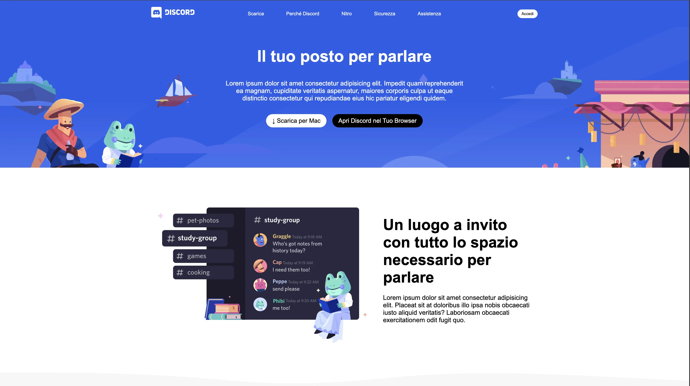

# 💬 Discord – Replica HTML & CSS

> [!NOTE]
>
> Riproduzione a scopo di esercitazione

Un progetto di **ricreazione frontend** ispirato alla homepage ufficiale di [Discord](https://discord.com).  
Sviluppato con **HTML5** e **CSS3**, questo esercizio ha l’obiettivo di consolidare le competenze nel layout responsive, nella gestione visiva delle sezioni e nell’organizzazione modulare del codice.

---

## 🎯 Obiettivo del progetto

L’obiettivo è **ricreare fedelmente il layout e lo stile visivo** della pagina iniziale di Discord, curando dettagli come:

- La **tipografia pulita e moderna**
- Le **transizioni fluide e armoniche**
- La **gerarchia visiva** tra testi, bottoni e immagini
- L’uso di **colori coerenti** con il brand ufficiale

Questo progetto permette di esercitare la creazione di sezioni ben strutturate e la gestione ottimizzata di **immagini, layout e contenuti testuali.**

---

---

## 💡 Tecnologie utilizzate

- **HTML5** → struttura semantica e accessibile
- **CSS3** → layout responsive e animazioni leggere
- **Flexbox / Grid** → gestione fluida del layout
- **Google Fonts** → tipografia coerente con il brand

---

## 📱 Design responsive

✅ Desktop  
✅ Tablet  
✅ Mobile

L’interfaccia è completamente **adattiva**, con layout fluidi e media query ottimizzate per tutte le risoluzioni.

---

byHYONS™
